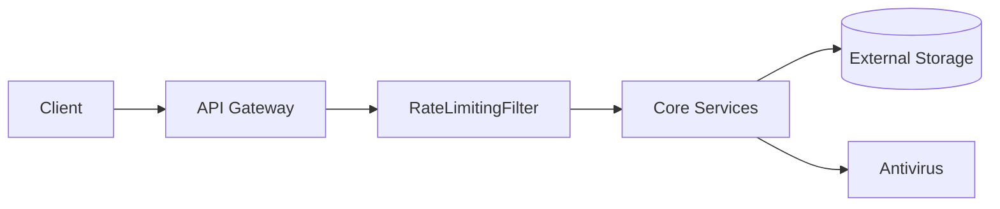
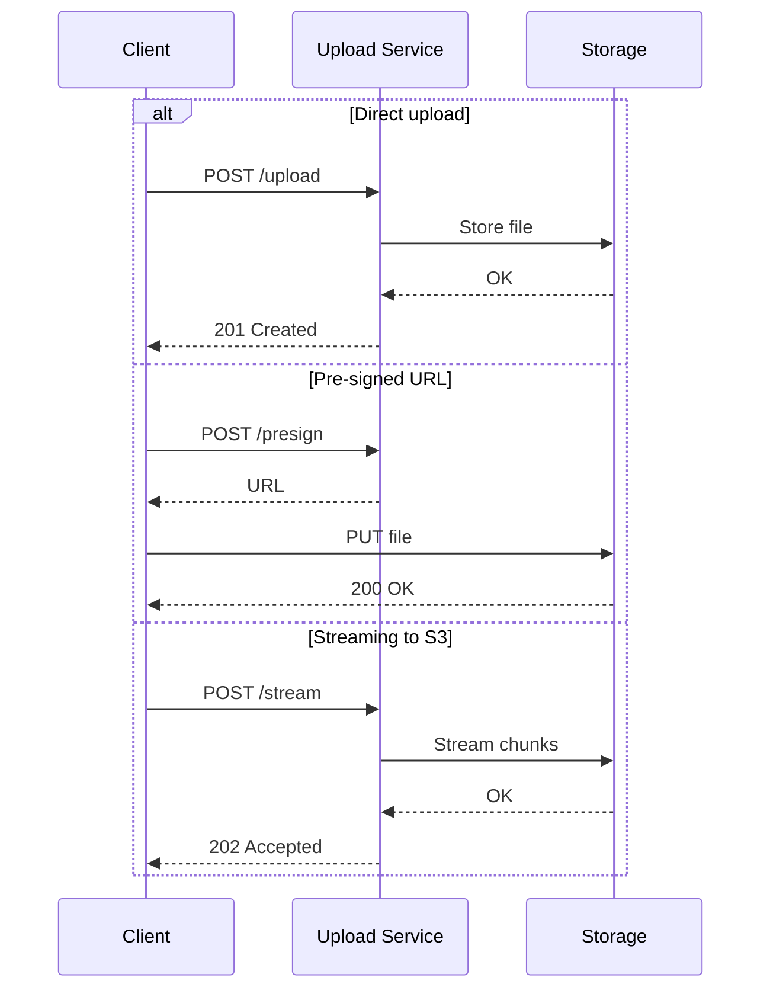
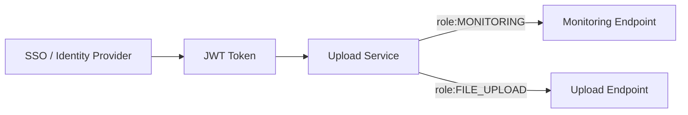
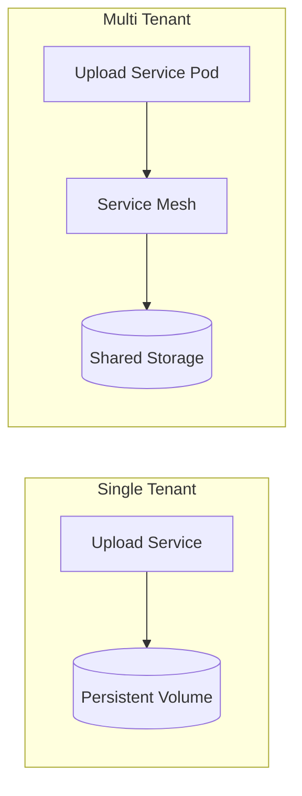
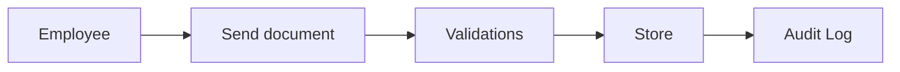
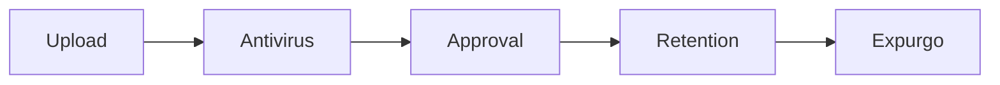

# Enterprise Visual Reference

## Solution Architecture Diagram

## Integration Patterns

## Security Models

## Deployment Topologies

## User Journey Map (HR Scenario)

## Process Flow Diagram (Compliance)

